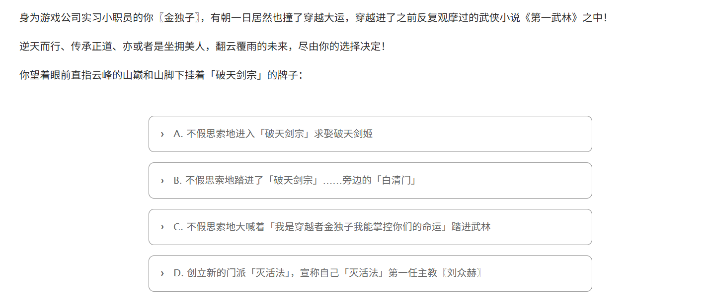
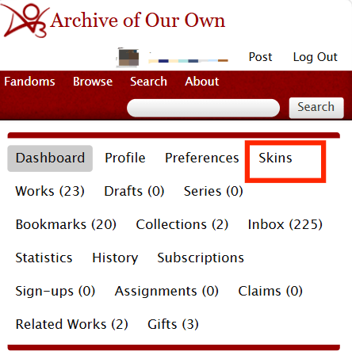
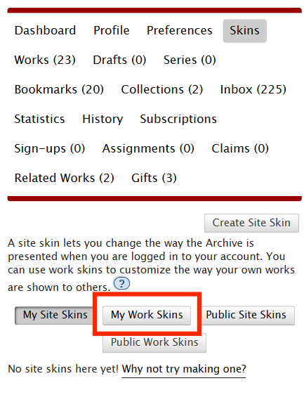
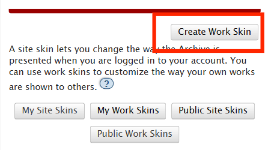
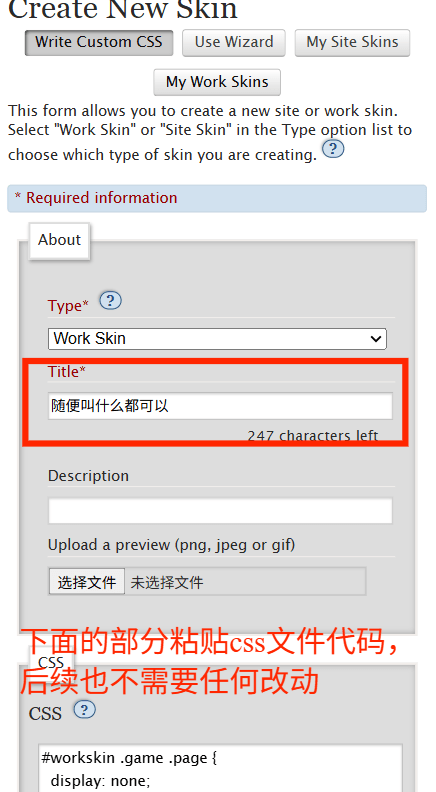
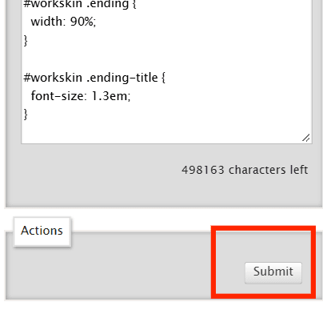
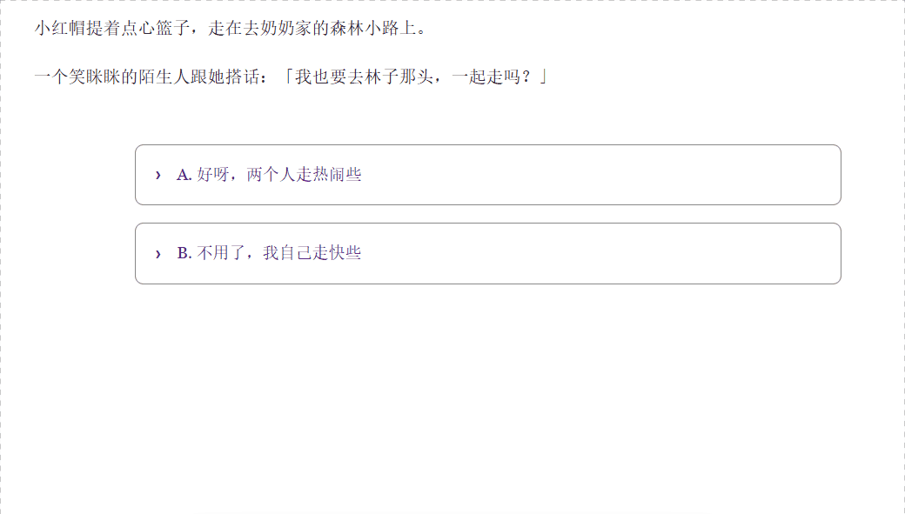

# AO3 文字冒险游戏 · 使用与修改说明

一个「点击选项 → 跳到下一页」的文字冒险小游戏，用纯 HTML + CSS 写成，可以直接发布在 AO3（Archive of Our Own）上。

**本文写给完全不懂代码的人**：不需要任何编程基础，只需要「替换模板文件中的中文部分」就能把它改成你自己的故事。
**本文示例的AO3链接**：https://archiveofourown.org/works/93072296

---

## 目录

1. [文件夹里有什么](#一文件夹里有什么)
2. [它是怎么运行的](#二它是怎么运行的)
3. [示例](#三示例)
4. [必须遵守的规则](#四必须遵守的规则)
5. [常见问题](#五常见问题)

---

## 一、文件夹里有什么

| 文件                    | 是什么                                                                                                 | 用途比                                        |
| ----------------------- | ------------------------------------------------------------------------------------------------------ | --------------------------------------------- |
| `html.html`             | 游戏的全部内容：剧情文字、选项文字、结局文字                                                           | **视觉小说剧情等**                            |
| `css.css`               | 游戏的规则和外观：哪一页该显示、哪一页该隐藏、按钮长什么样。                                           | **把这个文件里面的代码粘贴到ao3的workskin中** |
| `preview-local.html`    | 仅供在自己电脑上双击打开预览效果的版本，有兴趣可以下载下来在本地点着玩                                 | 本文较长的示例文件                            |
| `demo-xiaohongmao.html` | 第五节《小红帽》示例的本地预览版，仅用于查看简短的演示效果，双击就能玩，有兴趣可以下载下来在本地点着玩 | 简短的示例                                    |

> **特别提醒**：`html.html` 不是普通网页。它只是网页的「中间一段」，必须配合 AO3 的「作品皮肤（Work Skin）」才能运行。所以：
>
> - ❌ 直接双击打开 `html.html` → 你会看到所有页面从上到下挤成一团（因为 `css.css` 里的规则都带 `#workskin` 前缀，只在 AO3 上生效）。
> - ✅ 想在发布前看效果 → 双击 `preview-local.html`（本地预览版），或者按第三步发到 AO3 用「Preview 预览」。

---

## 二、它是怎么运行的

整个游戏只有三种零件：

1.  **页面**：每一段剧情都包在一个「盒子」里，写成 `<div class="page">……</div>`。  
     默认状态下，所有盒子都是藏起来的。**对代码没有兴趣的话，直接复制第五部分的代码改里面的文字部分就好。**

    例如，下面就是起始页那一页的完整代码：

    ```html
    <div class="page page-start">
      <p><a name="p1" class="anchor" rel="nofollow"></a></p>

      <p>
        身为游戏公司实习小职员的你〖金独子〗，有朝一日居然也撞了穿越大运，穿越进了之前反复观摩过的武侠小说《第一武林》之中！
      </p>

      <p>
        逆天而行、传承正道、亦或者是坐拥美人，翻云覆雨的未来，尽由你的选择决定！
      </p>

      <p>你望着眼前直指云峰的山巅和山脚下挂着「破天剑宗」的牌子：</p>
      <div class="choices">
        <p>
          <a href="#p2" rel="nofollow">
            A. 不假思索地进入「破天剑宗」求娶破天剑姬
          </a>
        </p>

        <p>
          <a href="#p3" rel="nofollow">
            B. 不假思索地踏进了「破天剑宗」……旁边的「白清门」
          </a>
        </p>

        <p>
          <a href="#p4" rel="nofollow">
            C. 不假思索地大喊着「我是穿越者金独子我能掌控你们的命运」踏进武林
          </a>
        </p>

        <p>
          <a href="#p5" rel="nofollow">
            D. 创立新的门派「灭活法」，宣称自己「灭活法」第一任主教〖刘众赫〗
          </a>
        </p>
      </div>
    </div>
    ```

**上面这段代码发布到 AO3 之后，起始页长这样**（A/B/C/D 四个选项都可以点，点哪个就跳到哪一页）：



2.  **门牌号**：每个盒子的开头都挂着一块门牌，写成 `<a name="p2" ...>`，表示「这一页叫 p2」。

```html
<p><a name="p1" class="anchor" rel="nofollow"></a></p>
```

3.  **链接（选项）**：每个选项都是一个链接，写成 `<a href="#p2">A. 进入门派</a>`，意思是「点了就去 p2 那一页」。

点击选项后，浏览器网址末尾会多出 `#p2`，CSS 一看：「哦，现在被点中的是 p2」——于是只把 p2 那个盒子显示出来，其他继续藏着。这就是全部原理。

**总结：选项 = 一个指向某页的门牌号链接；剧情 = 藏在门牌号后面的内容。**

游戏里没有任何「计算」，没有存档、没有分数、没有随机——AO3 不允许运行 JavaScript，所以所有的「逻辑」都只能表现为「跳到哪一页」。想做多分支，就把分支写成更多的页。

---

## 三、示例

> 前提：你有一个 AO3 账号，并且会发普通文章（不会的话先看 AO3 官方的发文教程）。

**第 1 步：创建「作品皮肤」（存放 css.css 的地方）**





点这个，然后确定


**第 2 步：把你的小说修改为这种结构**
动键盘之前，先拿张纸（或开个记事本）把「玩家会遇到什么选择、每个选择通向哪里」画出来。例如：

```
森林小路上，一个笑眯眯的陌生人想和小红帽一起走
    │
    ├─ A. 好呀，一起走 ──────→ 【结局】到了奶奶家，发现他很眼熟 → 拆穿诡计，活着逃出去
    │
    └─ B. 不用了，我自己走 ──→ 【结局】到了奶奶家，没认出「奶奶」→ 被吃掉
```

玩家要做 **1 次**选择，一共需要 **3 个页面**（1 个起始页 + 2 个结局）。

```
森林小路上，一个笑眯眯的陌生人想和小红帽一起走
```

的代码：
(name="p1"，说明一行是p1段落，page-start：说明这里是起始章节。**对代码没兴趣不需要注意这些细节，在开始的段落按这个格式加上就好**)

```html
<div class="page page-start">
  <p><a name="p1" class="anchor" rel="nofollow"></a></p>

  <p>森林小路上，一个笑眯眯的陌生人想和小红帽一起走</p>
</div>
```

两个选项的代码：

```html
<div class="choices">
  <p>
    <a href="#endA" rel="nofollow">A. 好呀，两个人走热闹些</a>
  </p>

  <p>
    <a href="#endB" rel="nofollow">B. 不用了，我自己走快些</a>
  </p>
</div>
```

合在一起：
**注意选项（choices）那一行也是包裹在p1段落里面，选项是p1的一部分**

```html
<div class="page page-start">
  <p><a name="p1" class="anchor" rel="nofollow"></a></p>

  <p>森林小路上，一个笑眯眯的陌生人想和小红帽一起走。</p>

  <div class="choices">
    <p>
      <a href="#endA" rel="nofollow">A. 好呀，两个人走热闹些</a>
    </p>

    <p>
      <a href="#endB" rel="nofollow">B. 不用了，我自己走快些</a>
    </p>
  </div>
</div>
```

结局A的代码：

```html
<div class="page">
  <p><a name="endA" class="anchor" rel="nofollow"></a></p>
  <div class="ending">
    <div class="ending-title">
      <p>END A</p>
    </div>

    <p>
      你和陌生人一起走到了奶奶家。推开门，床上坐着一个「奶奶」，被子一直拉到下巴。
    </p>

    <p>你忽然愣住——那双眼睛、那个笑法，和路上遇到的那个人一模一样。</p>

    <p>你一把掀开被子，被子下面露出一条毛茸茸的大尾巴。</p>

    <p>你抓起篮子转身就跑，边跑边喊救命。猎人循声赶来，你和奶奶都活了下来。</p>
  </div>
  <div class="choices">
    <p>
      <a href="#p1" rel="nofollow">↻ 重新开始</a>
    </p>
  </div>
</div>
```

结局B的代码：

```html
<div class="page">
  <p><a name="endB" class="anchor" rel="nofollow"></a></p>
  <div class="ending">
    <div class="ending-title">
      <p>END B</p>
    </div>

    <p>你婉拒了那个人，一个人赶到了奶奶家。</p>

    <p>
      「奶奶」躺在床上，声音有点沙哑，被子拉得很高。你没多想，坐到床边，把点心一块块递过去。
    </p>

    <p>被子下面，慢慢伸出一只毛茸茸的爪子……</p>

    <p>森林里，从此少了一个提篮子的小姑娘。</p>
  </div>
  <div class="choices">
    <p>
      <a href="#p1" rel="nofollow">↻ 重新开始</a>
    </p>
  </div>
</div>
```

全部代码：

```html
<div class="game">
  <div class="warning">
    <p>娱乐性质游戏，请勿上纲上线！</p>
  </div>

  <div class="page page-start">
    <p><a name="p1" class="anchor" rel="nofollow"></a></p>

    <p>小红帽提着点心篮子，走在去奶奶家的森林小路上。</p>

    <p>一个笑眯眯的陌生人跟她搭话：「我也要去林子那头，一起走吗？」</p>

    <div class="choices">
      <p>
        <a href="#endA" rel="nofollow">A. 好呀，两个人走热闹些</a>
      </p>

      <p>
        <a href="#endB" rel="nofollow">B. 不用了，我自己走快些</a>
      </p>
    </div>
  </div>

  <div class="page">
    <p><a name="endA" class="anchor" rel="nofollow"></a></p>
    <div class="ending">
      <div class="ending-title">
        <p>END A</p>
      </div>

      <p>
        你和陌生人一起走到了奶奶家。推开门，床上坐着一个「奶奶」，被子一直拉到下巴。
      </p>

      <p>你忽然愣住——那双眼睛、那个笑法，和路上遇到的那个人一模一样。</p>

      <p>你一把掀开被子，被子下面露出一条毛茸茸的大尾巴。</p>

      <p>
        你抓起篮子转身就跑，边跑边喊救命。猎人循声赶来，你和奶奶都活了下来。
      </p>
    </div>
    <div class="choices">
      <p>
        <a href="#p1" rel="nofollow">↻ 重新开始</a>
      </p>
    </div>
  </div>

  <div class="page">
    <p><a name="endB" class="anchor" rel="nofollow"></a></p>
    <div class="ending">
      <div class="ending-title">
        <p>END B</p>
      </div>

      <p>你婉拒了那个人，一个人赶到了奶奶家。</p>

      <p>
        「奶奶」躺在床上，声音有点沙哑，被子拉得很高。你没多想，坐到床边，把点心一块块递过去。
      </p>

      <p>被子下面，慢慢伸出一只毛茸茸的爪子……</p>

      <p>森林里，从此少了一个提篮子的小姑娘。</p>
    </div>
    <div class="choices">
      <p>
        <a href="#p1" rel="nofollow">↻ 重新开始</a>
      </p>
    </div>
  </div>
</div>
```

效果：


---

## 四、必须遵守的规则

1. **门牌号全篇唯一。** 两个页面不能有相同的 `name`。
2. **链接必须指得准。** `href="#xxx"` 里的 xxx 必须和某个页面的 `name="xxx"` **一字不差**——大小写要一致，`#` 不能少，也不能多空格。指错了，玩家点下去就是一片空白。
3. **新页面要和别的页面「平级」。** 都放在最外层 `<div class="game">` 里面，**不要**塞进另一个 `.page` 盒子的里面。塞错了会出现「点了没反应」的 bug（这个文件此前就出过一次这个 bug，已修复）。
4. **标签必须成对。** 有 `<div>` 就要有对应的 `</div>`，有 `<p>` 就要有 `</p>`。少一个，后面的所有页面都会错位。
5. **引号必须是英文直引号 `"`。** 不要用中文引号 “ ” 代替标签里的引号。
6. **不要加 `<script>`、`<style>` 或 `<form>`。** AO3 会直接删掉它们。

---

## 五、常见问题

**Q1：点选项没反应 / 跳过去是空白？**  
九成是 `href="#xxx"` 和目标页的 `name="xxx"` 对不上（少了 `#`、打错字、大小写不一致），或者那个页面被嵌进了另一个页面的盒子里（见第七节第 3 条）。

**Q2：所有页面从头到尾一起显示出来了？**  
没有启用作品皮肤，或者 CSS 没粘对。检查发文时是否选了第 1 步建的那个 Work Skin。

**Q3：粘贴后排版错乱、多出很多空行？**  
AO3 的编辑器会自动把空行变成段落。解决办法：让 HTML 里「标签与标签之间」不要夹空行（空行只出现在正文段落之间）；并且确认是在 **HTML** 编辑模式下粘贴，而不是富文本模式。

**Q4：能不能加存档、分数、好感度、随机数？**  
不能。AO3 会删除 JavaScript 和表单控件，游戏只能靠「跳转到哪一页」实现。想要「好感度影响结局」，只能通过多写分支页来模拟。

**Q5：手机上能玩吗？**  
能。这套写法本身就是手机友好的——选项是整行的大按钮，方便手指点击。

**Q6：想改按钮颜色、字体大小？**  
去改 `css.css`。例如 `border: 1px solid #888` 是按钮边框颜色，`background: #eee` 是鼠标悬停时的底色。注意 AO3 只接受一部分 CSS 属性，保存时若报错说明用到了不支持的属性，改回原样即可。

**Q7：本地能预览吗？**  
可以，双击 `preview-local.html` 即可（它已经内置了样式，改完 `html.html` 后需要重新生成它才能看到最新内容；不会生成的话，直接在 AO3 上用 Preview 预览也完全够用）。

**Q8：这一版修复了什么？**  
2026-09-30：修复了 `html.html` 中 p2、p3、p4、p5 四页被误嵌套进起始页内部的问题——该问题会导致在 AO3 上点击起始页的 A/B/C/D 选项后整页空白。现已将四页移至与起始页同级，并用浏览器实测跳转正常。

---

_文档对应文件版本：html.html、css.css_
